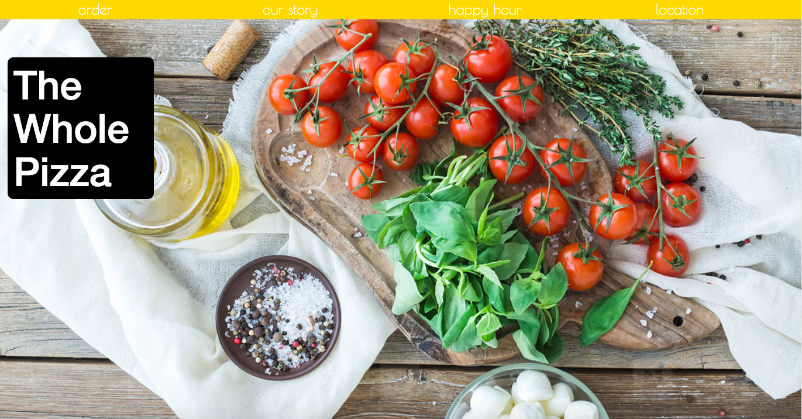
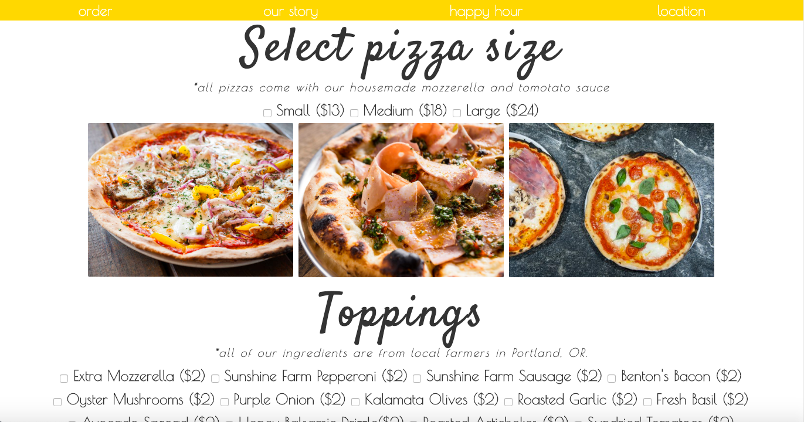

# _Independent Project Week 4_

#### _Intro, Week 4, *06.21.2019*_

#### By _Jessica Doss_

## Description
_This site was created to demonstrate skills learned in JavaScript. The user should be able to put in a custom order for pizza and get a returned value._

## Site Design

_I wanted to make this site feel like a real world application that you would visit. Portland is full of local businesses and it was important to convey that in my design._

## Setup/Installation Requirements

* Clone this repository "https://github.com/pdxjess/pizza-project"
* To deploy project: https://pdxjess.github.io/pizza-project
* Open the file and view in the web browser of preference.

## Specs

| Behavior | Input | Output |
| ------------- |:-------------:| -----:|
| User can select pizza size | User clicks on checkbox | The pizza size they desire is selected |
| User can add toppings to the pizza | User clicks multiple checkboxs | All desired toppings are selected |
<<<<<<< HEAD
| User can get total of order | User selects size and toppings and clicks total | Total is shown |
=======
| User can get total of order | User selects size and toppings and clicks total | Total is shown |

## Known Bugs

_Refresh button does not refresh properly._

## Support and contact details

_Should any problems occur, discover other bugs, or experience issues with viewing, please contact me at doss.jessicam@gmail.com_

## Technologies Used

_This was created with:_
* Atom
* Git
* CSS
* HTML
* Jquery
* Bootstrap
* JavaScript

## Acknowledgements

_Thank you to my teachers and partners this week. I wouldn't be where I am without you all._

### License

*This software is licensed under MIT license.*

Copyright (c) 2019 **_Jessica Doss_**
